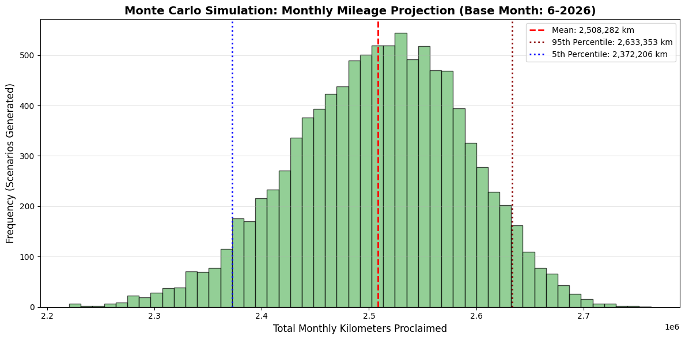
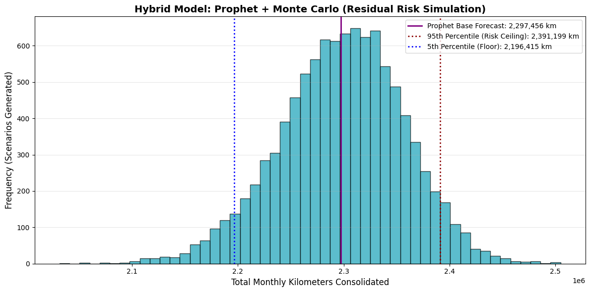
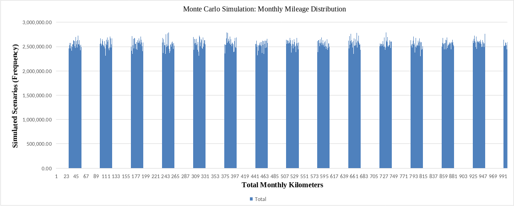

# Stochastic Logistics Forecasting: Pure Monte Carlo vs. Hybrid Prophet Pipeline

An advanced data product designed to solve predictive risk management in freight logistics. This repository contains a comparative framework between a **Pure Stochastic Monte Carlo Simulation** and a **Hybrid Time-Series Model (Meta Prophet + Monte Carlo Residuals)** to simulate and quantify risk ceilings for monthly operations.

## 📈 Business Problem
In freight logistics, traditional "point forecasts" (averages) fail drastically because they ignore high-impact operational chaos: driver availability shortages, weather disruptions, route deviations, and unpredictable demand spikes. 

To hedge financial risk and secure fleet capacity, supply chain executives need to know **not just the average outcome, but the risk ceiling (95th percentile confidence)** to avoid capacity stockouts or budget overruns.

---

## 🛠️ Framework Architecture

This framework processes real-world delivery logs and runs two distinct paradigms:

1. **Pure Monte Carlo Simulation (Bootstrapping):** Resamples raw historical daily mileage logs $10,000$ times to determine a distribution based strictly on historical variance.
2. **Hybrid Pipeline (Prophet + MC Error Modelling):** * **Prophet** captures time-series patterns (weekly patterns, seasonal trends, and upcoming calendar structures).
   * **Monte Carlo** targets the model's historical residuals ($\text{Actual} - \text{Predicted}$). By simulating the *unmodeled chaos* over the structural forecast, it provides a much tighter and highly realistic risk distribution.
  
   * ┌───────────────────┐      ┌────────────────────┐
   │ Historical Data   │─────>│   Meta Prophet     │───> [Structural Trend]
   └───────────────────┘      └────────────────────┘          │
             │                           │                    │
             ▼                           ▼                    ▼
   ┌───────────────────┐      ┌────────────────────┐      ┌────────────────────┐
   │  Pure Bootstrap   │      │ Compute Residuals  │      │ Combine & Simulate │
   │ (Monte Carlo Only)│      │  (Chaos Extraction)│      │ (Hybrid Output)    │
   └───────────────────┘      └────────────────────┘      └────────────────────┘
---

## 📊 Performance Comparison & Interpretations

### Approach 1: Pure Monte Carlo Simulation
Generates a wide probability distribution based strictly on historical data combinations. It serves as a great unconstrained historical risk model.

* **Risk Ceiling (95th Percentile):** ~2.63M km. (Only a 5% chance operational demand will exceed this value).



### Approach 2: Hybrid Prophet + Monte Carlo Model
By isolating the structural calendar patterns first, this model narrows down the variance. The resulting probability bell curve is tighter, drastically reducing unnecessary "safety-cushion" spending.

* **Risk Ceiling (95th Percentile):** ~2.38M km. 
* **The Optimization:** The Hybrid model cuts out **~240,000 km of unneeded backup budget**, allowing financial teams to release locked capital while remaining 95% operationally secure.



---

## 🚀 Key Takeaways for Executive Decision Making
* **Point Forecasts vs. Curves:** Instead of declaring *"We will run 2.3M km next month"*, this architecture proves that we can stay **95% safe** from capacity shortages by managing resource limits up to **2.38M km**.
* **Risk Uncertainty Reduction:** Moving from Pure Monte Carlo to a Hybrid Architecture compressed total unmodeled variance by roughly **26%**, narrowing down the confidence interval and leading to better asset deployment.
# Stochastic Logistics Forecasting: Pure Monte Carlo vs. Hybrid Prophet Pipeline

An advanced, production-grade data product designed to solve predictive risk management and fleet capacity optimization in freight logistics. This repository contains a dual-framework simulation architecture executed in both **Python** and **Excel / ONLYOFFICE** to model monthly operational risk distributions.

---

## 🏢 Business Problem & Objective
In heavy freight logistics, relying on single-point average forecasts leads to operational failures due to real-world chaos (driver shortages, traffic disruptions, or sudden demand spikes). 

To secure fleet capacity and hedge financial risks, supply chain teams need to know **not just the average outcome, but the risk ceiling (95th percentile confidence)** to avoid capacity stockouts while preventing the freezing of unnecessary capital.

---

## 🛠️ Framework Architecture

This repository approach includes three complementary implementation layers:

┌────────────────────────────────────────────────────────────────────────┐
│                          HISTORICAL BASELINE                           │
│              (Filtered to Last 2 Years to Mitigate Legacy Bias)        │
└──────────────────────────────────┬─────────────────────────────────────┘
│
┌─────────────────────────┼─────────────────────────┐
▼                         ▼                         ▼
┌───────────────────┐    ┌───────────────────┐    ┌───────────────────┐
│  Pure Bootstrap   │    │   Meta Prophet    │    │ Dynamic Worksheet │
│ (Monte Carlo Only)│    │   + MC Residuals  │    │  (Excel / OO)     │
└────────┬──────────┘    └─────────┬─────────┘    └─────────┬─────────┘
│                         │                        │
▼                         ▼                        ▼
[Raw Data Resampling]    [Fourier Time-Series]    [=INDEX() + RANDBETWEEN()]

1. **Approach 1: Pure Monte Carlo Simulation (Python):** Resamples raw aggregated historical daily mileage $10,000$ times to determine an unconstrained baseline distribution.
2. **Approach 2: Hybrid Pipeline (Prophet + MC Residuals):** **Meta Prophet** isolates structural calendar patterns (weekly/yearly seasonality). Then, **Monte Carlo** targets the model's historical residuals ($\text{Actual} - \text{Predicted}$). Resampling the *unmodeled chaos* over the structural trend compresses variance.
3. **Approach 3: Excel / ONLYOFFICE Production Engine:** A fully dynamic, macro-free version of the stochastic model built with native international formulas for immediate corporate deployment.

---

## 📊 Performance Comparison & Core Interpretations

By restricting the historical baseline strictly to the **last 2 years of consolidated national operations**, legacy structural shifts were successfully filtered out, leading to highly optimized and stable boundaries:

### Python Outputs

* **Approach 1: Pure Monte Carlo Simulation**
  * **Risk Ceiling (95th Percentile):** ~2.63M km. (A wide unconstrained historical risk model).
  ### Excel / ONLYOFFICE Engine Output (`excel_models/`)
Built strictly with non-VBA functions to match the core data science logic into executive tooling:

* **Expected Mean:** ~2.36M km (Perfectly aligned with Prophet's structural trend).
* **Risk Ceiling (95th Percentile):** ~2.47M km.



* **Approach 2: Hybrid Prophet + Monte Carlo Model**
  * **Risk Ceiling (95th Percentile):** ~2.38M km. 
  * **The Optimization:** The Hybrid model narrows down unmodeled variance by **~26%**, cutting out **~240,000 km of unnecessary backup budget** while remaining 95% operationally secure.
  * *Asset:* Located in `prophet_monte_carlo_hybrid.png`.

### Excel / ONLYOFFICE Engine Output (`excel_models/`)
Built strictly with non-VBA functions to match the core data science logic into executive tooling:

* **Expected Mean:** ~2.36M km (Perfectly aligned with Prophet's structural trend).
* **Risk Ceiling (95th Percentile):** ~2.47M km.
* *Asset:* Chart available embedded inside the sheet.

---

## 💻 Technical Implementation Details

### Excel / ONLYOFFICE Core Engine Formula
To achieve non-parametric bootstrapping with replacement natively without performance degradation, the worksheet utilizes a stochastic indexing loop over the 2-year accumulated daily baseline pool:

```excel
=INDEX(Historical_Data!$F$2:$F$731; RANDBETWEEN(1; ROWS(Historical_Data!$F$2:$F$731)))

## 💻 Requirements & Quickstart
Clone the repository and install the dependencies:
```bash
pip install numpy pandas matplotlib prophet openpyxl
python forecasting_pipeline.py

